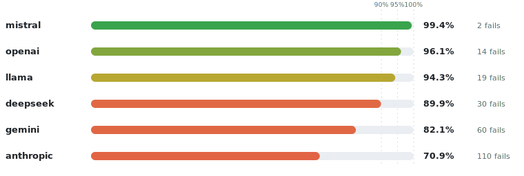
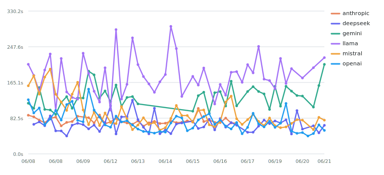
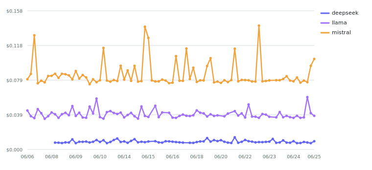
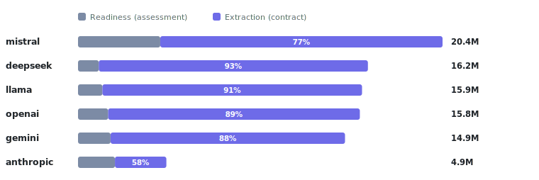
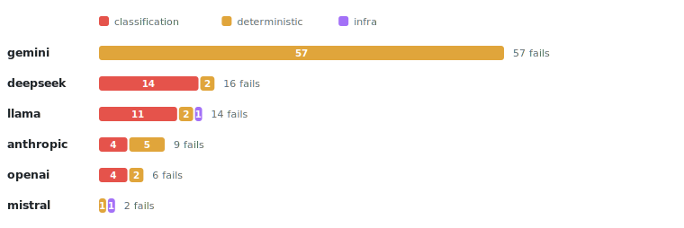
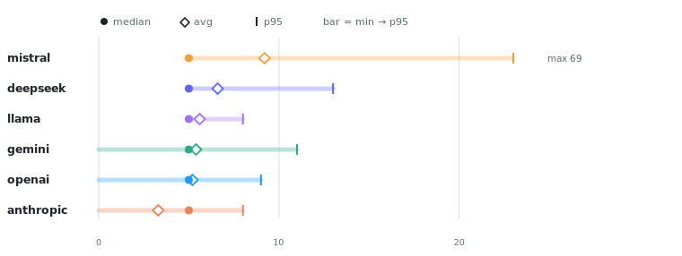

# 🔬 Smoke Health

<picture>
  <source media="(prefers-color-scheme: dark)" srcset="assets/smoke-health/summary-dark.svg">
  
</picture>

> [!NOTE]
> **Report-only · all recorded runs.** _Provider_ = the model family under test. Pass/fail reflects the authoritative post-retry outcome joined from `test.xml`.

## Provider scorecard

<picture>
  <source media="(prefers-color-scheme: dark)" srcset="assets/smoke-health/scorecard-dark.svg">
  
</picture>

<b>Full table</b> — pass-rate bars, fails, cost & tokens per run

| Provider | Pass rate | Fails | $/run | Tokens | Model family |
|---|:--|--:|--:|--:|---|
| `mistral` | `█████████████▉` 99.2% | 2 | $0.4621 | 16.63M | `mistral-large-2411, mistral-small-2506` |
| `openai` | `█████████████▊` 97.8% | 6 | $0.5109 | 13.11M | `gpt-4.1, gpt-4.1-mini` |
| `llama` | `█████████████▎` 94.5% | 14 | $0.2243 | 11.69M | `meta-llama/llama-3.3-70b-instruct` |
| `anthropic` | `█████████████░` 93.1% | 20 | n/a | 7.16M | `claude-haiku-4-5, claude-sonnet-4-6` |
| `deepseek` | `████████████▊░` 91.3% | 18 | $0.0485 | 11.35M | `deepseek-chat` |
| `gemini` | `███████████░░░` 78.2% | 57 | n/a | 10.80M | `gemini-2.5-flash, gemini-2.5-pro` |

_\* `anthropic`, `gemini` cost is `n/a` — provider has no configured pricing._

## Latency

_Average LLM response time per provider over runs (seconds, wall-clock)._

<picture>
  <source media="(prefers-color-scheme: dark)" srcset="assets/smoke-health/latency-trend-dark.svg">
  
</picture>

## Cost per test

> [!CAUTION]
> Cost is normalised **per test** — shard sizes vary run-to-run, so raw per-run totals aren't comparable. `anthropic`, `gemini` are excluded (no configured pricing).

<picture>
  <source media="(prefers-color-scheme: dark)" srcset="assets/smoke-health/cost-trend-dark.svg">
  
</picture>

## Token split — readiness vs extraction

_Tokens spent in the cheap readiness gatekeeper (`ProcessInputAssessment`) vs the expensive extraction stage (`ValidatedProcessContract`), per provider._

<picture>
  <source media="(prefers-color-scheme: dark)" srcset="assets/smoke-health/token-split-dark.svg">
  
</picture>

## Failure categories

> [!TIP]
> `deterministic` = harness/config failure (e.g. context load) · `classification` = the model produced a wrong answer · `infra` = timeout/transport. This separates _"the harness broke"_ from _"the model struggled."_

<picture>
  <source media="(prefers-color-scheme: dark)" srcset="assets/smoke-health/failure-split-dark.svg">
  
</picture>

<b>Failure detail</b> — counts, share & sample signatures

| Provider | Category | Failures | % of fails | Sample signature |
|---|---|--:|--:|---|
| `gemini` | deterministic | 57 | 100.0 | `business rule task()::429 - [{` |
| `deepseek` | classification | 16 | 88.9 | `error boundary event()::Expected an activity carrying a ERROR boundary event, b…` |
| `anthropic` | deterministic | 16 | 80.0 | `call activity()::400 - {"type":"error","error":{"type":"invalid_request_error",…` |
| `llama` | classification | 11 | 78.6 | `error boundary event()::Expected an activity carrying a ERROR boundary event, b…` |
| `openai` | classification | 4 | 66.7 | `error boundary event()::Expected an activity carrying a ERROR boundary event, b…` |
| `anthropic` | classification | 4 | 20.0 | `error boundary event()::Expected an activity carrying a ERROR boundary event, b…` |
| `openai` | deterministic | 2 | 33.3 | `event-based gateway()::RECEIVE (act-await-response) requires messageName` |
| `llama` | deterministic | 2 | 14.3 | `event-based gateway()::RECEIVE (act-wait-for-response) requires messageName` |
| `deepseek` | deterministic | 2 | 11.1 | `escalation end()::TIMER (boundaryEvent) requires detail` |
| `mistral` | deterministic | 1 | 50.0 | `event subprocess()::EVENT_GATEWAY (br-no-cancel) requires triggerKind` |
| `mistral` | infra | 1 | 50.0 | `timer boundary event()::timer boundary event() timed out after 240 seconds` |
| `llama` | infra | 1 | 7.1 | `exclusive gateway()::exclusive gateway() timed out after 240 seconds` |

## Flaky tests

> [!WARNING]
> Fails **across providers** ⇒ the test or prompt is suspect. Fails on **one provider** ⇒ a model limit.

| Test | Fail rate | Providers failed | Samples |
|---|:--|---|--:|
| `error boundary event()` | `█████████▉░░` 41.3% | 5 — anthropic, deepseek, gemini, llama, openai | 46 |
| `escalation end()` | `████▏░░░░░░░` 17.4% | 3 — anthropic, deepseek, gemini | 46 |
| `intermediate signal throw()` | `███▍░░░░░░░░` 14.0% | 2 — gemini, llama | 43 |
| `escalation boundary event()` | `███▏░░░░░░░░` 13.0% | 3 — anthropic, deepseek, gemini | 46 |
| `standard loop activity()` | `███▏░░░░░░░░` 13.0% | 3 — anthropic, deepseek, gemini | 46 |
| `event-based gateway()` | `███▏░░░░░░░░` 12.8% | 2 — llama, openai | 47 |

25 more flaky tests (≤ 11.6% fail rate)

| Test | Fail rate | Providers failed | Samples |
|---|:--|---|--:|
| `signal end()` | `██▊░░░░░░░░░` 11.6% | 2 — gemini, llama | 43 |
| `exclusive gateway()` | `██▋░░░░░░░░░` 10.9% | 3 — anthropic, gemini, llama | 46 |
| `business rule task()` | `██▎░░░░░░░░░` 9.3% | 1 — gemini | 43 |
| `data objects and stores()` | `██▎░░░░░░░░░` 9.3% | 1 — gemini | 43 |
| `manual task()` | `██▎░░░░░░░░░` 9.3% | 1 — gemini | 43 |
| `message start()` | `██▎░░░░░░░░░` 9.3% | 1 — gemini | 43 |
| `sequential multi-instance activity()` | `██▎░░░░░░░░░` 9.3% | 1 — gemini | 43 |
| `timer start()` | `██▎░░░░░░░░░` 9.3% | 1 — gemini | 43 |
| `parallel gateway()` | `██▏░░░░░░░░░` 8.7% | 2 — gemini, llama | 46 |
| `script task()` | `██▏░░░░░░░░░` 8.7% | 2 — anthropic, gemini | 46 |
| `parallel multi-instance activity()` | `█▌░░░░░░░░░░` 6.5% | 3 — anthropic, deepseek, gemini | 46 |
| `call activity()` | `█▍░░░░░░░░░░` 5.9% | 2 — anthropic, gemini | 34 |
| `embedded subprocess()` | `█░░░░░░░░░░░` 4.3% | 2 — anthropic, gemini | 46 |
| `event subprocess()` | `█░░░░░░░░░░░` 4.3% | 2 — gemini, mistral | 46 |
| `exclusive gateway with default branch()` | `█░░░░░░░░░░░` 4.3% | 2 — anthropic, gemini | 46 |
| `intermediate message throw()` | `█░░░░░░░░░░░` 4.3% | 2 — gemini, llama | 47 |
| `send task()` | `█░░░░░░░░░░░` 4.3% | 2 — anthropic, gemini | 46 |
| `timer boundary event()` | `█░░░░░░░░░░░` 4.3% | 2 — gemini, mistral | 46 |
| `error end()` | `▌░░░░░░░░░░░` 2.2% | 1 — gemini | 46 |
| `pools and lanes from distinct actors()` | `▌░░░░░░░░░░░` 2.2% | 1 — gemini | 46 |
| `intermediate escalation throw()` | `▌░░░░░░░░░░░` 2.1% | 1 — deepseek | 47 |
| `message end()` | `▌░░░░░░░░░░░` 2.1% | 1 — gemini | 47 |
| `receive task()` | `▌░░░░░░░░░░░` 2.1% | 1 — gemini | 47 |
| `signal start()` | `▌░░░░░░░░░░░` 2.1% | 1 — gemini | 47 |
| `terminate end()` | `▌░░░░░░░░░░░` 2.1% | 1 — openai | 47 |

## LLM efficiency

> [!IMPORTANT]
> `mistral` is the outlier — median 8 calls/test but a P95 of 23 and a max of **69**, suggesting retry or tool-loop storms. Every other provider sits at a median of 5.

<picture>
  <source media="(prefers-color-scheme: dark)" srcset="assets/smoke-health/llm-efficiency-dark.svg">
  
</picture>

---

📖 How this repo works — ingest, querying & setup → [`ABOUT.md`](ABOUT.md) · Regenerated every run by `render_dashboard.py`. Machine-managed — do not edit by hand.
