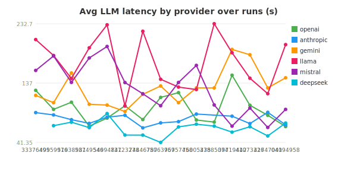
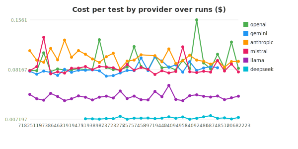
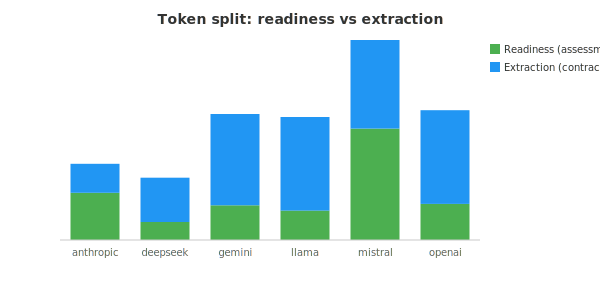

# 🔬 Smoke Health

_Report-only · all recorded runs · provider = model family under test._

## Provider scorecard

| Provider | Model | Runs | Pass % | Fails | $/run | Tokens |
|---|---|---:|---:|---:|---:|---:|
| anthropic | `claude-haiku-4-5,claude-sonnet-4-6` | 30 | 95.5 | 8 | n/a* | 4586742 |
| deepseek | `deepseek-chat` | 22 | 89.4 | 12 | $0.0459 | 6191626 |
| gemini | `gemini-2.5-flash,gemini-2.5-pro` | 30 | 92.1 | 13 | n/a* | 7845891 |
| llama | `meta-llama/llama-3.3-70b-instruct` | 30 | 93.6 | 11 | $0.2342 | 7957007 |
| mistral | `mistral-large-2411,mistral-small-2506` | 30 | 98.7 | 2 | $0.4503 | 11026817 |
| openai | `gpt-4.1-mini,gpt-4.1` | 30 | 97.7 | 4 | $0.5361 | 8620099 |

_\* cost unknown — provider has no configured pricing._

## Flaky tests (fail across providers ⇒ test/prompt suspect; one provider ⇒ model limit)

| Test | Fail % | Providers failed | Samples |
|---|---:|---|---:|
| `error boundary event()` | 41.4 | 5 (anthropic, deepseek, gemini, llama, openai) | 29 |
| `escalation end()` | 20.7 | 3 (anthropic, deepseek, gemini) | 29 |
| `standard loop activity()` | 13.8 | 3 (anthropic, deepseek, gemini) | 29 |
| `exclusive gateway()` | 10.3 | 3 (anthropic, gemini, llama) | 29 |
| `event-based gateway()` | 17.2 | 2 (llama, openai) | 29 |
| `intermediate signal throw()` | 10.7 | 2 (gemini, llama) | 28 |
| `signal end()` | 7.1 | 2 (gemini, llama) | 28 |
| `script task()` | 6.9 | 2 (anthropic, gemini) | 29 |
| `parallel gateway()` | 6.9 | 1 (llama) | 29 |
| `business rule task()` | 3.6 | 1 (gemini) | 28 |
| `data objects and stores()` | 3.6 | 1 (gemini) | 28 |
| `manual task()` | 3.6 | 1 (gemini) | 28 |
| `message start()` | 3.6 | 1 (gemini) | 28 |
| `sequential multi-instance activity()` | 3.6 | 1 (gemini) | 28 |
| `timer start()` | 3.6 | 1 (gemini) | 28 |
| `event subprocess()` | 3.4 | 1 (mistral) | 29 |
| `intermediate escalation throw()` | 3.4 | 1 (deepseek) | 29 |
| `intermediate message throw()` | 3.4 | 1 (llama) | 29 |
| `terminate end()` | 3.4 | 1 (openai) | 29 |
| `timer boundary event()` | 3.4 | 1 (mistral) | 29 |

## Failure categories

_`deterministic` = harness/config failure (e.g. context load); `classification` = the model produced a wrong answer. Separates 'the harness broke' from 'the model struggled'._

| Provider | Category | Failures | % of provider fails | Sample signature |
|---|---|---:|---:|---|
| anthropic | deterministic | 5 | 62.5 | error boundary event()::400 - {"type":"error","error":{"type":"invalid_reques… |
| anthropic | classification | 3 | 37.5 | error boundary event()::Expected an activity carrying a ERROR boundary event,… |
| deepseek | classification | 10 | 83.3 | error boundary event()::Expected an activity carrying a ERROR boundary event,… |
| deepseek | deterministic | 2 | 16.7 | escalation end()::TIMER (boundaryEvent) requires detail |
| gemini | deterministic | 13 | 100.0 | business rule task()::429 - [{ |
| llama | classification | 8 | 72.7 | error boundary event()::Expected an activity carrying a ERROR boundary event,… |
| llama | deterministic | 2 | 18.2 | event-based gateway()::RECEIVE (act-wait-for-response) requires messageName |
| llama | infra | 1 | 9.1 | exclusive gateway()::exclusive gateway() timed out after 240 seconds |
| mistral | infra | 1 | 50.0 | timer boundary event()::timer boundary event() timed out after 240 seconds |
| mistral | deterministic | 1 | 50.0 | event subprocess()::EVENT_GATEWAY (br-no-cancel) requires triggerKind |
| openai | classification | 2 | 50.0 | error boundary event()::Expected an activity carrying a ERROR boundary event,… |
| openai | deterministic | 2 | 50.0 | event-based gateway()::RECEIVE (act-await-response) requires messageName |

## Stage breakdown

_Per-pipeline-stage model and token usage (readiness vs extraction)._

| Provider | Stage | Model | Prompt tokens | Completion tokens | LLM calls | Samples |
|---|---|---|---:|---:|---:|---:|
| anthropic | ProcessInputAssessment | `claude-haiku-4-5` | 1130631 | 935094 | 429 | 176 |
| anthropic | ValidatedProcessContract | `claude-sonnet-4-6` | 1486706 | 317278 | 342 | 176 |
| deepseek | ProcessInputAssessment | `deepseek-chat` | 673911 | 487890 | 294 | 113 |
| deepseek | ValidatedProcessContract | `deepseek-chat` | 4005906 | 187954 | 252 | 113 |
| gemini | ProcessInputAssessment | `gemini-2.5-flash` | 1048623 | 771882 | 426 | 164 |
| gemini | ValidatedProcessContract | `gemini-2.5-pro` | 5155058 | 301354 | 308 | 164 |
| llama | ProcessInputAssessment | `meta-llama/llama-3.3-70b-instruct` | 966105 | 399063 | 432 | 172 |
| llama | ValidatedProcessContract | `meta-llama/llama-3.3-70b-instruct` | 5886330 | 208052 | 386 | 172 |
| mistral | ProcessInputAssessment | `mistral-small-2506` | 3043116 | 1556328 | 1308 | 159 |
| mistral | ValidatedProcessContract | `mistral-large-2411` | 5362878 | 314444 | 338 | 159 |
| openai | ProcessInputAssessment | `gpt-4.1-mini` | 1051815 | 631557 | 474 | 176 |
| openai | ValidatedProcessContract | `gpt-4.1` | 6042814 | 253950 | 394 | 176 |

## LLM efficiency

_Distribution of LLM API calls per test — more calls may indicate retries or tool loops._

| Provider | Min | Avg | Median | P95 | Max | σ | Samples |
|---|---:|---:|---:|---:|---:|---:|---:|
| anthropic | 0 | 5.3 | 5 | 8 | 14 | 1.5 | 176 |
| deepseek | 5 | 6.7 | 5 | 14 | 20 | 3.2 | 113 |
| gemini | 0 | 5.3 | 5 | 8 | 20 | 2.5 | 164 |
| llama | 5 | 5.7 | 5 | 9 | 15 | 1.6 | 172 |
| mistral | 5 | 11.7 | 8 | 32 | 69 | 10.2 | 159 |
| openai | 5 | 6.0 | 5 | 11 | 23 | 2.5 | 176 |

## Latency

_Average LLM response time per provider over runs (seconds, wall-clock)._

## Cost trends

_Cost **per test** — shard sizes vary run-to-run, so raw per-run totals aren't comparable._

## Token split (readiness vs extraction)

_Tokens spent in the cheap readiness gatekeeper vs the expensive extraction stage, per provider._

